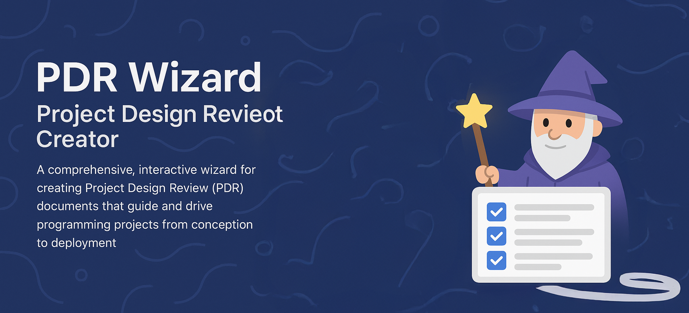

# 🧙‍♂️ PDR Wizard - Project Design Review Creator

*CursorRIPER♦Σ Lite 1.0.0 Implementation*

A comprehensive, interactive wizard for creating Project Design Review (PDR) documents that guide and drive programming projects from conception to deployment.

## 🚀 Quick Start

### 1. **Immediate Use** (Copy & Paste)
The PDR Wizard is available as a complete React component in the artifact above. Simply:

1. Copy the entire component code from the **"PDR Document Creation Wizard"** artifact
2. Replace the content in `src/components/PDRWizard.tsx` with the copied code
3. Run `npm start` to launch the wizard

### 2. **Full Setup** (Development Environment)
```bash
# Install dependencies
npm install

# Start development server
npm start

# Build for production
npm run build

# Deploy (with Vercel)
npm run deploy
```

## 📋 Features

### 🎯 **Core Functionality**
- **Interactive Wizard Interface** - Step-by-step PDR creation
- **Project Type Templates** - 6 pre-configured project types
- **Dynamic Sections** - Sections adapt based on project type
- **Form Validation** - Comprehensive input validation
- **Progress Tracking** - Visual progress and navigation
- **Export Options** - Markdown, JSON, and clipboard export

### 🏗️ **Project Types Supported**
1. **Web Applications** - Frontend/fullstack projects
2. **Mobile Applications** - iOS/Android/cross-platform
3. **API/Backend Services** - Microservices and APIs
4. **Desktop Applications** - Electron, native apps
5. **Data/Analytics Projects** - Data science, ML projects
6. **Infrastructure Projects** - DevOps, cloud architecture

### 📊 **PDR Sections**
- **📋 Project Overview** - Description, objectives, scope, stakeholders
- **🏗️ Technical Architecture** - Architecture, technologies, dependencies
- **🎯 Implementation Plan** - Milestones, timeline, resources, risks
- **🔒 Security & Compliance** - Security requirements, compliance, data privacy
- **🚀 Deployment Strategy** - Environment, CI/CD, monitoring, rollback
- **📊 Data Architecture** - Data models, storage, backup, migration

## 📁 Project Structure

```
Project PDR/
├── memory-bank/              # CursorRIPER♦Σ Framework Memory
│   ├── projectbrief.md       # σ₁: Project requirements and scope
│   ├── systemPatterns.md     # σ₂: Architecture and design patterns
│   ├── techContext.md        # σ₃: Technology stack and tools
│   ├── activeContext.md      # σ₄: Current focus and next steps
│   ├── progress.md           # σ₅: Progress tracking and milestones
│   ├── symbols.md            # Symbol reference guide
│   └── backups/              # Automated backups
├── src/
│   ├── components/
│   │   └── PDRWizard.tsx     # Main wizard component
│   ├── App.tsx               # Application entry point
│   └── index.css             # Tailwind CSS styles
├── examples/
│   └── web-app-pdr-example.md # Sample PDR output
├── IMPLEMENTATION_GUIDE.md   # Complete implementation guide
├── package.json              # Project dependencies
└── tailwind.config.js        # Tailwind configuration
```

## 🔧 Technology Stack

### **Frontend Framework**
- **React 18** with TypeScript
- **Tailwind CSS** for styling
- **Lucide React** for icons

### **Key Features**
- **Zero External Dependencies** (beyond React ecosystem)
- **Local Storage Persistence** - Automatic draft saving
- **Responsive Design** - Works on all devices
- **Export Functionality** - Multiple output formats
- **Form Validation** - Real-time validation and error handling

## 📚 Usage Guide

### **Step 1: Project Type Selection**
Choose from 6 project types to get customized PDR sections:
- Web Application → 5 sections
- Mobile Application → 5 sections  
- API/Backend Service → 5 sections
- Desktop Application → 4 sections
- Data/Analytics Project → 4 sections
- Infrastructure Project → 5 sections

### **Step 2: Section Completion**
Complete each section with guided prompts:
- **Required fields** marked with red asterisk (*)
- **Real-time validation** with helpful error messages
- **Auto-save** progress to local storage
- **Navigation** between completed sections

### **Step 3: Review & Export**
- **Preview** complete PDR content
- **Export** as Markdown file
- **Copy** to clipboard for sharing
- **Download** for documentation

## 🎨 Customization

### **Adding New Project Types**
```typescript
// Add to PROJECT_TYPES array in PDRWizard.tsx
{
  id: 'blockchain',
  name: 'Blockchain Project',
  icon: Coins,
  sections: ['overview', 'technical', 'implementation', 'security']
}
```

### **Adding New Sections**
```typescript
// Add to PDR_SECTIONS object in PDRWizard.tsx
smartContract: {
  title: "Smart Contract Architecture",
  icon: FileCode,
  required: true,
  fields: ['contractSpecs', 'tokenomics', 'gasOptimization']
}
```

### **Custom Styling**
Modify `src/index.css` or `tailwind.config.js` for custom themes and styling.

## 🚀 Deployment Options

### **1. Static Hosting (Recommended)**
```bash
npm run build
# Deploy to Vercel, Netlify, or any static host
```

### **2. Docker Deployment**
```dockerfile
FROM node:18-alpine
WORKDIR /app
COPY package*.json ./
RUN npm ci
COPY . .
RUN npm run build
EXPOSE 3000
CMD ["npm", "start"]
```

### **3. Integration Deployment**
Embed the PDRWizard component in existing applications:
```typescript
import PDRWizard from './components/PDRWizard';

// Use in modals, tabs, or dedicated pages
<PDRWizard onComplete={handlePDRComplete} />
```

## 📖 Framework Documentation

### **CursorRIPER♦Σ Lite 1.0.0**
This project uses the CursorRIPER♦Σ Lite framework for structured development:

- **📂 Memory Bank** - Persistent project knowledge and context
- **🔄 RIPER Modes** - Research, Innovate, Plan, Execute, Review cycles  
- **🏗️ Phase Management** - Structured project progression
- **📊 Progress Tracking** - Automated milestone and completion tracking

### **Memory Files**
- **σ₁ Project Brief** - Requirements, scope, success criteria
- **σ₂ System Patterns** - Architecture, components, design decisions
- **σ₃ Technical Context** - Technology stack, dependencies, constraints
- **σ₄ Active Context** - Current focus, recent changes, next steps
- **σ₅ Progress Tracker** - Completion status, milestones, issues

## 🤝 Contributing

### **Enhancement Ideas**
- **Template Marketplace** - Community-contributed templates
- **AI-Assisted Completion** - Smart suggestions and auto-completion
- **Collaboration Features** - Real-time editing and review
- **Integration APIs** - Connect with project management tools
- **Advanced Export** - PDF, Word, and presentation formats

### **Development Setup**
1. Fork the repository
2. Create feature branch: `git checkout -b feature/new-feature`
3. Make changes and test thoroughly
4. Update documentation as needed
5. Submit pull request with detailed description

## 📈 Advanced Features

### **Persistence Options**
- **Local Storage** (default) - Browser-based draft saving
- **Cloud Storage** - Firebase, AWS, or custom backend
- **API Integration** - REST APIs for enterprise integration

### **Export Enhancements**
- **PDF Generation** - Styled PDF documents
- **Word Documents** - Microsoft Word format export
- **JSON Schema** - Machine-readable project data
- **API Endpoints** - Programmatic access to PDR data

### **Integration Patterns**
- **Standalone Application** - Independent PDR creation tool
- **Modal Integration** - Embed in existing project tools
- **Workflow Integration** - Part of larger project setup process

## 🔒 Security & Privacy

### **Data Privacy**
- **Client-Side Processing** - All data processed locally
- **No External Transmission** - Data never leaves user's browser
- **Local Storage Only** - Drafts saved to browser storage
- **Export Control** - User controls all data export

### **Security Features**
- **Input Validation** - Comprehensive form validation
- **XSS Prevention** - React's built-in protection
- **Content Sanitization** - Safe handling of user input

## 📋 Examples

### **Sample PDR Output**
See `examples/web-app-pdr-example.md` for a complete PDR document generated by the wizard.

### **Integration Examples**
- **Modal Integration** - Embed in project management dashboards
- **Workflow Integration** - Part of project setup wizards
- **API Integration** - Connect with development tools

## 🆘 Support & Resources

### **Documentation**
- **Implementation Guide** - `IMPLEMENTATION_GUIDE.md`
- **Framework Documentation** - Memory bank files
- **Code Comments** - Comprehensive inline documentation

### **Community**
- **GitHub Issues** - Bug reports and feature requests
- **Discussions** - Questions and community support
- **Wiki** - Extended documentation and tutorials

### **Professional Support**
- **Consulting** - Custom implementation assistance
- **Training** - Team training and onboarding
- **Enterprise** - Custom features and integrations

---

## 🎯 Getting Started

**Ready to create your first PDR?**

1. **Copy the wizard code** from the artifact above
2. **Replace** `src/components/PDRWizard.tsx` content
3. **Run** `npm start` to launch the application
4. **Create** your first Project Design Review!

*Built with CursorRIPER♦Σ Lite Framework for streamlined project development.*
